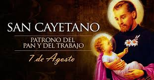

# Devoción popular 

## Ejercicio integrador

**En la vispera de la fiesta del santo patrono de los trabajadores y las trabajadoras, nos preparamos para organizar mejor la devoción de miles de fieles que concurren a su santuario con esperanza y renovado entusiamo.**

De las personas conocemos una serie de acciones destacadas que hicieron en su vida, su situación laboral, su estado de salud y si tienen esperanza o no.

Cuando una persona va al santuario de San Cayetano, si ha realizado en su vida alguna de las acciones que son del agrado del santo, su situación laboral mejora, en caso contrario se vuelven a su casa tal como llegaron. Las acciones que le agradan son: "esfuerzo", "compartir" y "tener una estampita".

También está la Difunta Correa, que si bien ninguna de las iglesias tradicionales la tiene en su santoral, tiene seguidores que la consideran una santa y van a sus pequeños santuarios que suelen estar al costado de la ruta. Cuando un devoto de la difunta va a su santuario, en caso que alguna vez haya hecho la accion de dejar una botella con agua, se le mejora la salud.

Una de las devociones más recientes es la de Enrique Agelelli, obispo argentino asesinado por la dictadura militar y reconocido como mártir por la Iglesia Católica, junto a dos curas y un laico, todos en La Rioja. Se considera que ayuda a quienes han realizado alguna acción de compromiso social, pero no se sabe bien aún si causa algun otro efecto, además de que la persona vuelve con esperanza. (Se conoce una lista con todas las acciones que se consideran de compromiso social)

**Importante:**

El estado de salud puede considerarse que es un número, y que la mejora es un porcentaje.

El trabajo puede ser:

* Desocupado. La mejora consiste en lograr un trabajo informal.
* Informal. (se sabe el monto del ingreso). La mejora consiste en duplicar el ingreso, si el ingreso es bajo, o de pasar a ser trabajo registrado si el importe es alto, manteniendo el nivel de ingreso y sin adicional.
* Registrado (se sabe el monto del ingreso y un adicional). La mejora consiste en que el adicional aumenta, sumándosele el monto del ingreso.

Las acciones son simplemente una descripción de la acción que realizó una persona.

### Los requerimientos a resolver son:

1. Hacer las siguientes funciones
* visitaAlSantuario por la cual una persona va al santuario de un santo, y puede volver cambiada, de acuerdo a lo explicado.
* fiestaPatronal. Se trata de una celebración especial dedicada a un santo a la que concurre mucha gente. A todos los que asisten, se le producen dos veces los efectos propios de ir a ver al santo, en caso que verifique los requisitos.
* festival En ocasiones, se realizan festivales religiosos en los que participan personas de diferentes lugares y se llevan diferentes imágenes de santos. A todos los que van con esperanza, se le producen sucesivamente los efectos de todos los santos presentes, en caso que cumplan con sus repectivos requisitos. Obtener como queda el conjunto de participantes que llegaron al festival con esperanza.

2. Crear un nuevo personaje que pueda considerarse santo, de manera que sea compatible con todo lo anterior. (Al momente de definir cómo ayuda a sus seguidores y según qué condición, evitar complicarse con algo muy sofisticado como también no caer en una trivialidad) Sugerencias: Evita, Maradona, Papa Francisco, tu abuelita, san jose de cupertino (el patrono de los estudiantes), etc.

3. Mostrar ejemplos de consulta de las funciones anteriores, para lo cual se deben crear datos de ejemplo.

4. Justificar conceptualmente:

* ¿Que sucede en el festival si la lista de participantes es infinita? ¿Y si son infinitos santos?
* Mostrar un caso donde la composición de funciones haya sido de utilidad y explicar por qué.
